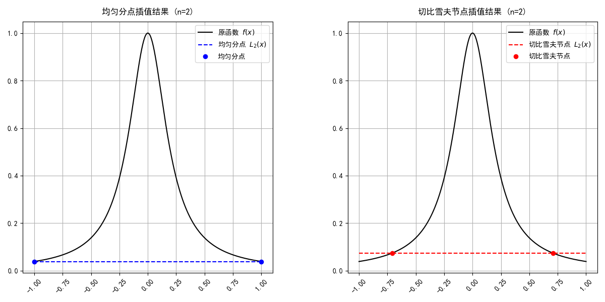
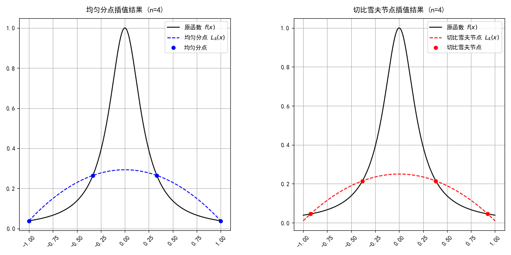
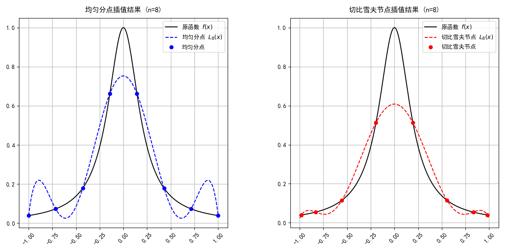
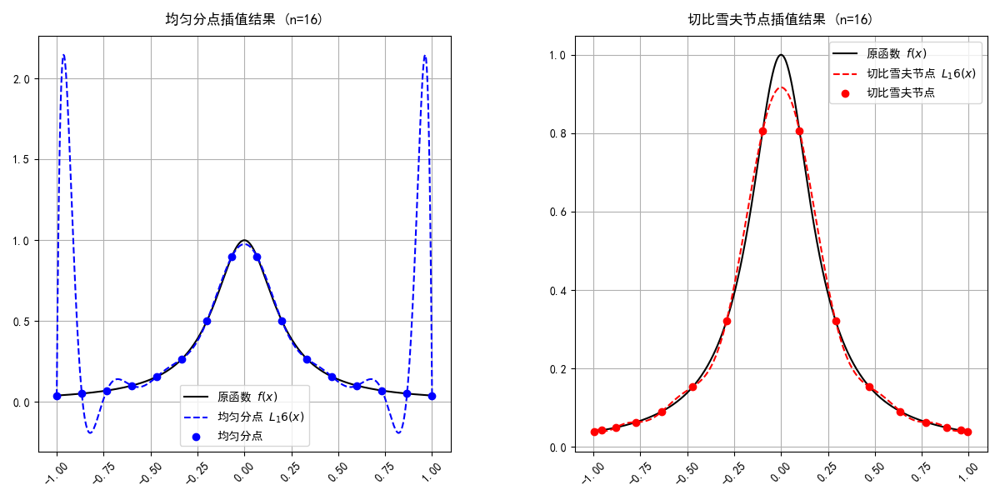

# **实验报告**

---

## **实验目标**

本实验旨在研究函数 $f(x) = \frac{1}{1 + 25x^2}$ 的插值特性，分析等距划分与非等距划分对插值误差的影响。通过绘制原函数及其拉格朗日插值多项式的图像，比较两种划分方式的插值结果，得出相关结论。

---

## **实验内容**

### **1. 原函数定义**

定义函数 $f(x)$ 为：

$$f(x) = \frac{1}{1 + 25x^2}$$

---

### **2. 拉格朗日插值多项式定义**

拉格朗日插值多项式 $L_n(x)$ 定义为：

$$L_n(x) = \sum_{i=1}^n f(x_i)l_i(x)$$

其中，$l_i(x)$ 表示拉格朗日基函数，其表达式为：

$$l_i(x) = \prod_{j=1, j \neq i}^n \frac{x - x_j}{x_i - x_j}$$

---

### **3. 实验步骤**

#### **(1) 考虑等距划分**

在区间 $[-1, 1]$ 上，选取等距划分点，分点公式为：

$$x_i = -1 + \frac{2i}{n},\ i = 0, 1, \cdots, n$$

依次取 $n = 2, 3, \cdots$，绘制原函数 $f(x)$ 及其拉格朗日插值多项式 $L_n(x)$ 在 $[-1, 1]$ 上的图像。

生成的图像包括：
- **等距划分，n=2 的插值图像**：`chart_n2.png`
- **等距划分，n=4 的插值图像**：`chart_n4.png`
- **等距划分，n=8 的插值图像**：`chart_n8.png`
- **等距划分，n=16 的插值图像**：`chart_n16.png`

---

#### **(2) 考虑非等距划分**

在区间 $[-1, 1]$ 上，选取非等距划分点（切比雪夫节点），分点公式为：

$$x_i = \cos\left(\frac{2i + 1}{2(n + 1)}\pi\right),\ i = 0, 1, \cdots, n$$

依次取 $n = 2, 3, \cdots$，绘制原函数 $f(x)$ 及其拉格朗日插值多项式 $L_n(x)$ 在 $[-1, 1]$ 上的图像。

---

#### **(3) 比较分析**

通过观察实验结果，分析以下问题：
1. 非等距划分在高次插值时是否更稳定？
2. 等距划分的误差是否随 $n$ 增大而发散？

---

## **实验结果**

以下为实验生成的插值图像：

1. **等距划分下的插值图像**
   - **$n=2$：**  
     
   - **$n=4$：**  
     
   - **$n=8$：**  
     
   - **$n=16$：**  
     

---

## **结论**

1. **非等距划分（切比雪夫节点）更稳定：**  
   实验结果表明，随着 $n$ 的增大，非等距划分的插值多项式不会出现剧烈震荡，表现出较好的稳定性。

2. **等距划分误差发散：**  
   在等距划分下，随着 $n$ 的增大，插值多项式在靠近区间边界处出现大幅震荡，插值误差显著增大。

3. **插值误差分析：**  
   非等距划分在高次插值时显著优于等距划分，是一种更优的插值节点选择方式。

